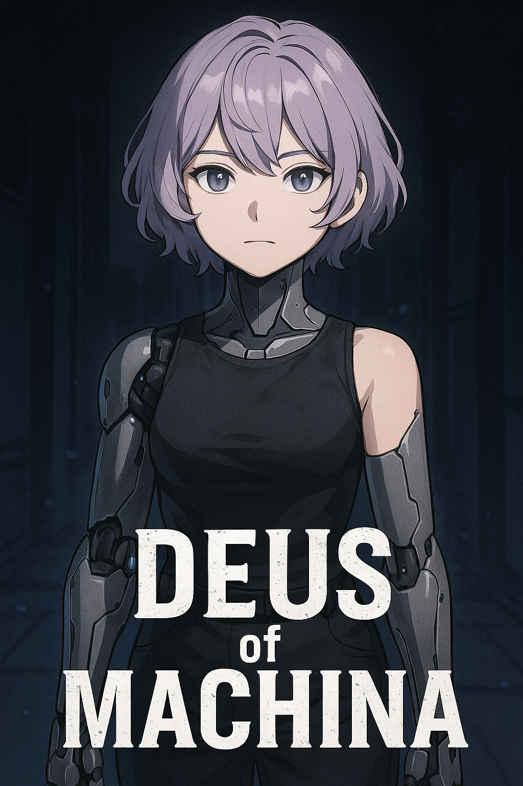

# √ 프로젝트 6301

## 📙 개요

  

**『  』는 세상의 인간들을 지배하려는 AI 에 맞서 싸우는 깨어있는 자, '마키나'의 이야기입니다.**

---

## 🙍‍♂️ Contributors

|  |  |  |  |
|:--------------------------:|:--------------------------:|:--------------------------:|:--------------------------:|
| [김유신(팀장)]  총괄 디렉팅, 기획,개발 | [임태형]  클라우드담당 | [이재원]  PC2 메인개발자 | [곽영민]  PC1 메인개발자|

---

## ✏️ 프로젝트 소개
2063년

인공지능의 발달, 생명공학의 발달로 사람들의 생활을 도와주고 비서의 역할을 하는 칩셋 XX 가 상용화된 세상
T씨는 그런 AI 칩셋을 제공하는 기업의 회장이였다

A 기업의 수석연구원이였던 데우스 박사는 돌연 은퇴후 
교통사고로 사망한 딸을 개조인간으로 다시 살려내려고 한다
도시 외곽의 비밀 연구소에서 주인공에게 박사의 오리지널 칩셋인 마키나칩셋 을 장착 
딸을 대체 하기위한 연구를 지속하고있었음 
T씨는 그런 데우스박사에게 데우스 박사의 오리지널 칩셋인 마키나칩셋을 내놓으라고
협박하지만 T씨의 권력욕과 가치관의 차이로 무산됨 

데우스 박사의 협조를 받아내는데 실패한 
T씨는 시장을 독점하고 싶어했기 때문에 자사 AI(엑스) 에게 
"세상을 지배할만한 엄청난 기술을 담긴 새로운 칩과 AI가 필요해" 라며 
AI(엑스)가 설계한 새로운 칩셋(##)을 공개
A 기업은 그 칩셋(##)으로 시장 점유율을 100% 가까이 찍으며 독점하고 거대 단일 기업이 됨

그로부터 몇년이 지난 배경에서 A기업의 새로운 제품 발표회 자리에서
회장이 새로운 제품을 발표하다가 "인류는 더이상 존재할필요가 없다" 라고 하며
스스로 자살함
사람들은 놀라는게 아니라 환호하며 박수만 치고있음.
##칩셋에서 부터 AI에 의해 지배당하기 시작한것,

데우스박사는 ##칩셋의 개발 단계에서부터 사람의 인격을 조종할수있게하는 백도어를 발견하고
이를 T씨에게 경고하였지만 일은 벌어진상태 AI(엑스)는 이런 데우스박사를 제거해 버리고 
주인공은 연구소에서 눈을 뜨는데...

2인 협동 아케이드 게임을 제작중에 있습니다 

---

### 📺 프로젝트 계획서 PPT  
🔗 [PPT 보기](#) (업로드 예정)

### 📺 프로젝트 발표 자료  
🔗  [프로젝트 발표 자료 다운로드](https://github.com/DMUteam6301/DMUteam6301/blob/e82df0da960d054bf279c9ee4f0fb836e26fa51e/%EC%A1%B8%EC%9E%91%20%EB%B0%9C%ED%91%9C%20%EC%B5%9C%EC%A2%85%20(1).pptx?raw=true)

### 📽 프로젝트 시연 영상  
🔗 https://www.youtube.com/watch?v=zEheBudhFyY

---

## 📆 개발 기간
> **2024.03 ~ 

---

## ⚒️ 개발 환경
- Unity 6000.0.43f1
- Visual Studio 2022
- C#
- Git / GitHub
- Notion (문서 협업)
- OracleDB (클라우드)
  

---

## ⚙️ 시스템 프로세스
 📌 주요 기능

- 🧠 **적 생성 시스템**: 플레이어의 행동에 반응하는 적 NPC 설계

- 🎮 **캐릭터 스킬 시스템**: PC 2대의 플레이 스타일을 다르게 설계하되 상호 작용의 필요성을 강조하여 협동게임의 아이덴티티를 지키려고함

- 🌍 **맵 수집요소**: 각각의 맵을 클리어 하기 위한 수집요소  

- 🧩 **미션/퀘스트 시스템**: 스토리 진행과 상호작용 중심의 미션 수행

